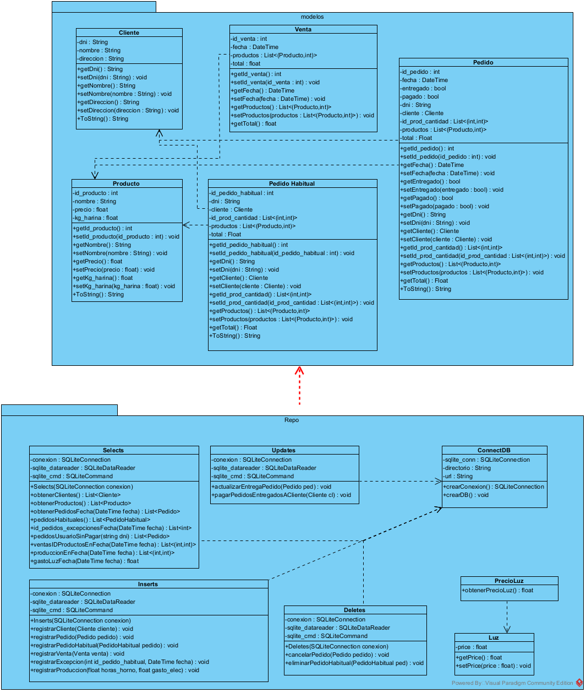
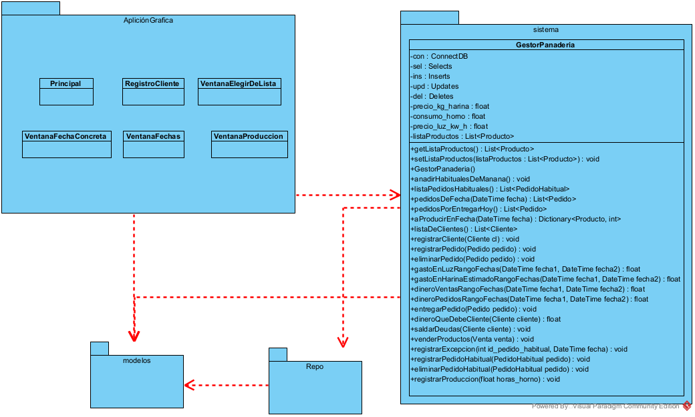
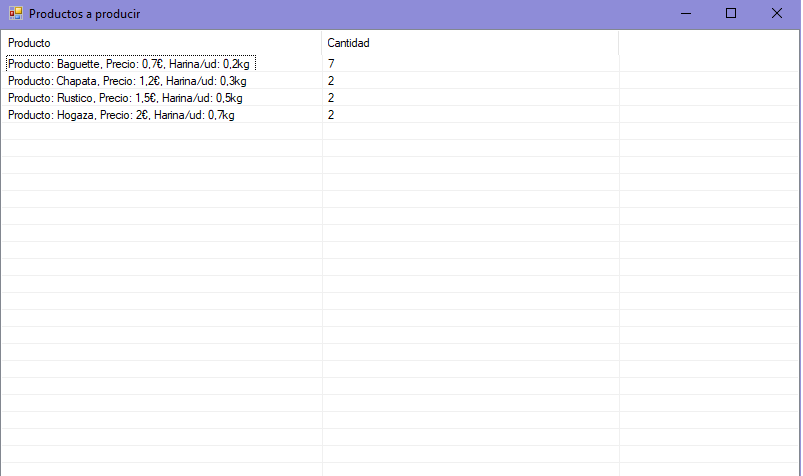
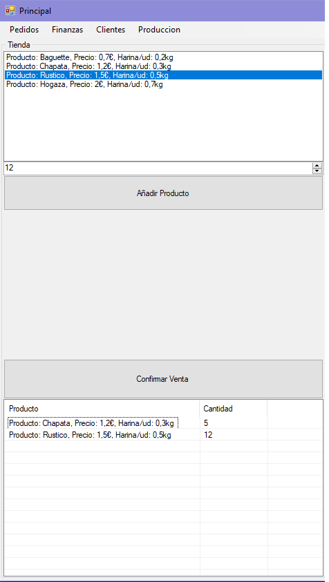

# PANADERÍA  

## Contexto  

Manolo tiene una panadería, en la que produce **4 tipos de panes**. A la madrugada produce el pan en su horno, y cada día produce lo que entregará en los **pedidos a domicilio** y lo que tendrá en la tienda.  

Hay clientes que tienen **pedidos habituales**, es decir, que se entregan todos los días salvo **excepciones** que los clientes especifican.  

Manolo quiere llevar las cuentas de lo que gasta en luz y en materias primas, y compararlo con lo que saca con los pedidos y **ventas**.  

Al tratarse de un valle en el que todos se conocen, Manolo tiene la confianza suficiente con los vecinos como para **no cobrar por adelantado**, sino que **cobra los pedidos entregados** a los clientes cuando se acercan a la tienda.  

Por temas de organización, Manolo pide una **antelación de 2 días para realizar un pedido**, así puede organizarse mejor. De la mísma manera, para **cancelar un pedido pide que le avisen con 2 días de adelanto**.  

## Automatización  

El programa automatizará y ofrecerá ayuda con los siguientes procesos:  
- Dirá que productos tiene que producir para los pedidos de ese mismo día.
- Se estimarán gastos cuando Manolo especifique lo que ha producido en el horno.
- Calculará los gastos y beneficios con los pedidos y ventas anotadas en el programa.
- Permitirá añadir nuevos clientes.
- Permitirá anotar pedidos, pedidos habituales, excepciones a estos...
- Permitirá anotar que pedido se ha entregado.
- Permitirá conocer la deuda de los clientes.
  
El programa no automatizará lo relacionado con los gastos del reparto ni empleados en caso de que los hubiese.  

## Diagramas  

En nuestro caso para obtener la persistencia de datos hemos optado por utilizar una base de datos **SQLite**.

### Diagrama entidad relación de la base de datos  

### Casos de uso de negocio  

  

### Casos de uso de sistema

### Diagrama de actividad al realizar un pedido  

### Diagrama de estado de un pedido  

### Diagrama de secuencia al realizar un pedido  

  

### Diagrama de clases   

- Modelos de Negocio: 
  

- Arquitectura:   

## Capturas de Ejecución  
Pantalla principal al iniciar el programa
  
Opciones en la pestaña de producción

Ventana al elegir "Ver Productos a Producir"  
  
Ventana al elegir "Especificar Producción de Hoy"
  
Opciones en la pestaña pedidos  
  
Ventana para elegir una opción de una lista. En este caso que pedido entregar. 
  
Para cancelar un pedido primero pregunta por la fecha.  
  
Opciones de la pestaña finanzas. Elegimos la opción balance. 
  
Pregunta el rango de fechas de los que ver los datos. Elegimos el día 11 de Mayo.
  
Se nos muestra en la ventana principal un gráfico de tipo "donut".
  
Realizamos una venta en la tienda.  
  
Pedimos otra vez el gráfico del balance de hoy y vemos como aparecen las ventas.
  
